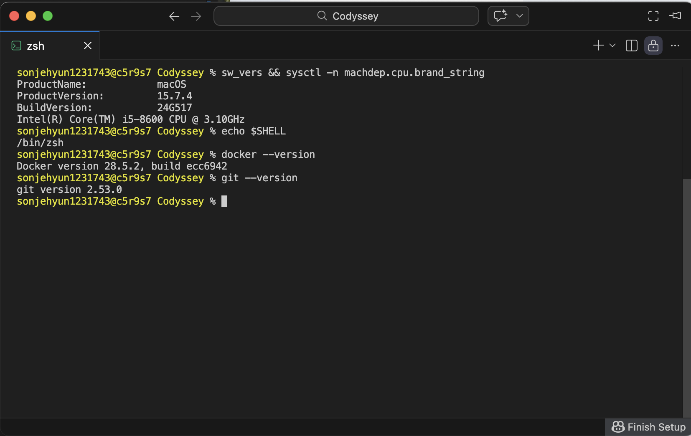
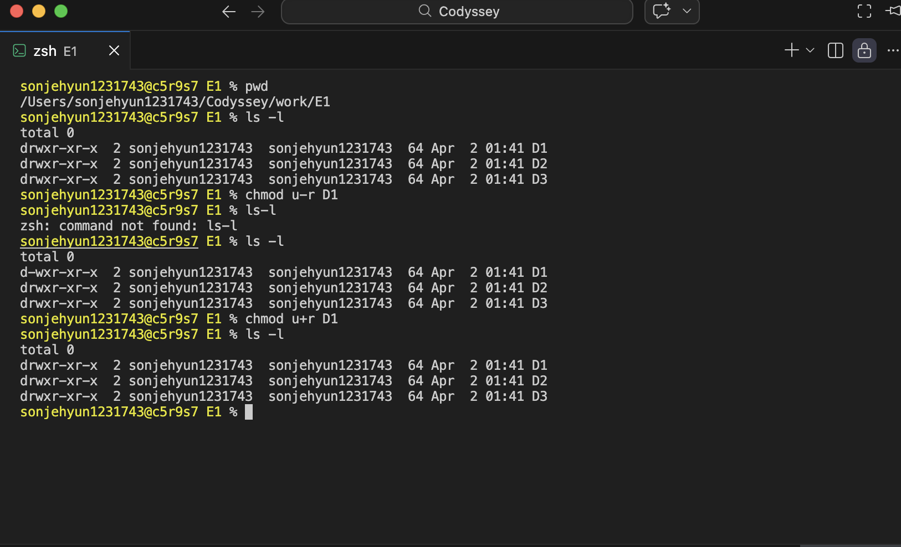
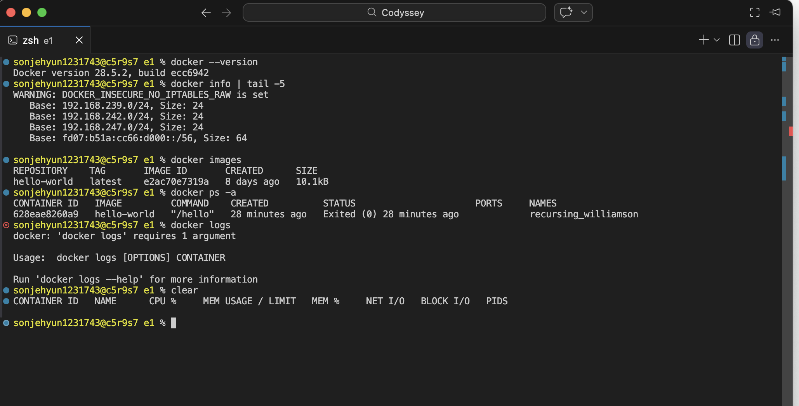
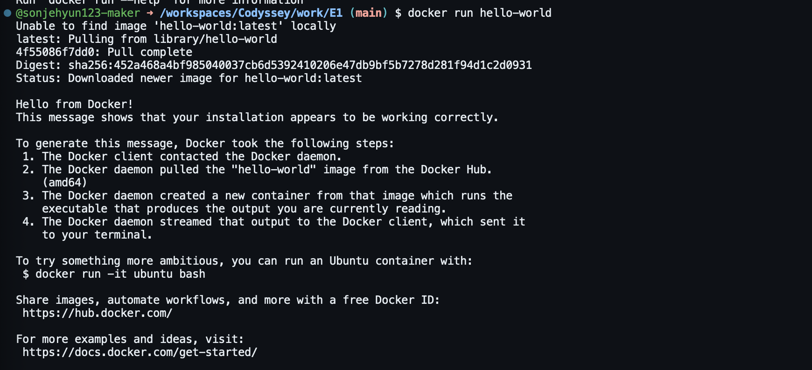
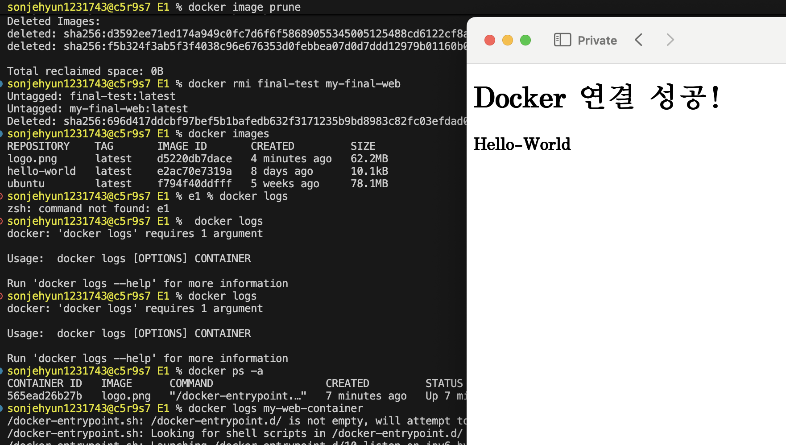
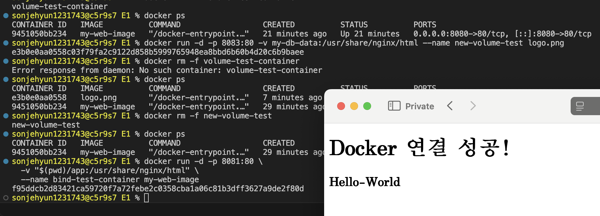
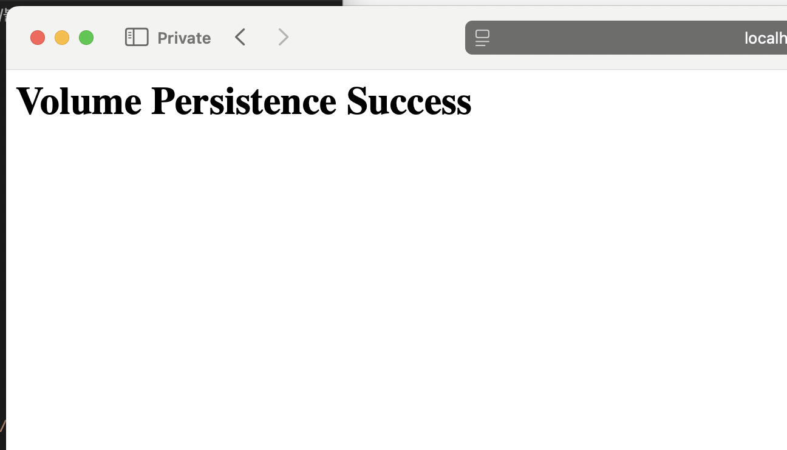

#Codyssey
# 터미널 작업 로그
 ** 이렇게하면 images에 있는 사진을 넣을수 있음.


# Github로 보내기 **중요**
## 1. 사진 파일을 저장소에 추가
git add log.jpg
## 2. 사진 추가했다는 메시지 남기기
git commit -m "docs: 실습 로그 스크린샷 추가"
## 3. GitHub로 보내기
git push -v

# 과제 (E-1)
## README.md란?
README.md는 프로젝트의 설명서 같은 파일
github에 보이는 첫 페이지!!

## 1. 제출 저장소
 - 공개로 설정한다
 - 저장소 링크만으로 아래 산출물 전부 확인 가능
  - 1. github 저장소 만들기
    2. Pubilc(공개)로 설정
    3. 과제파일 올리기 // 커멘드+s or ctrl+s 필수!!!
        1) git add .            //변경된 모든파일을 스테이징에 담음 
        2) git commit -m "내용"  //내용에는 파일 설명 / 내가 기억할 수 있는 이름
        3) git status           //내가 올릴 파일 확인 ** 초록색 및 저장필수!!!
        4) git remote -v        //깃허브 주소 다시 확인
        5) git push -v          //github에 올리기


## 2. 기술 문서 (README.md 등)
### 프로젝트 개요(미션 목표 요약)
    - 개발 환경 세팅을 스스로 수행
    - 터미널 CLI, Docker 컨테이너, Git 버전 관리의 핵심 원리를 이해, 재현 가능한 개발 환경을 구축

### 실행 환경(OS/쉘/터미널, Docker 버전, Git 버전)
 

```bash
sonjehyun1231743@c5r9s7 Codyssey % sw_vers && sysctl -n machdep.cpu.brand_string
ProductName:            macOS
ProductVersion:         15.7.4
BuildVersion:           24G517
Intel(R) Core(TM) i5-8600 CPU @ 3.10GHz
sonjehyun1231743@c5r9s7 Codyssey % echo $SHELL
/bin/zsh
sonjehyun1231743@c5r9s7 Codyssey % docker --version
Docker version 28.5.2, build ecc6942
```

    ####- OS:       macOS 15.7.4                        // sw_vers && sysctl -n machdep.cpu.brand_string
        - Shell:    /bin/zsh                            // echo $SHELL
        - Docker:   ocker version 28.5.2, build ecc6942 // docker --version
        - Git:      git version 2.53.0                  // git --version


### 수행 항목 체크리스트(터미널/권한/Docker/Dockerfile/포트/볼륨/Git/GitHub)
[v] 터미널 기본 조작 및 폴더 구성 (mkdir, ls, cd, rm)

```bash
sonjehyun1231743@c5r9s7 Codyssey % mkdir work #work 디렉토리 생성
sonjehyun1231743@c5r9s7 Codyssey % ls #Codyssey안에 있는 파일이름 확인
images          Readme.md       txt             work

sonjehyun1231743@c5r9s7 Codyssey % ls -l #파일의 정보 확인
total 8
drwxr-xr-x  3 sonjehyun1231743  sonjehyun1231743    96 Apr  1 23:39 images
-rw-r--r--  1 sonjehyun1231743  sonjehyun1231743  2701 Apr  1 23:52 Readme.md
drwxr-xr-x  3 sonjehyun1231743  sonjehyun1231743    96 Apr  1 23:42 txt
drwxr-xr-x  2 sonjehyun1231743  sonjehyun1231743    64 Apr  2 01:32 work

sonjehyun1231743@c5r9s7 Codyssey % cd work #work안으로 들어감
sonjehyun1231743@c5r9s7 work % pwd #work의 절대경로 확인
/Users/sonjehyun1231743/Codyssey/work #절대경로
sonjehyun1231743@c5r9s7 work % cd .. #work의 상위폴더인 Codyssey로 이동
sonjehyun1231743@c5r9s7 Codyssey % pwd #Codyssey의 절대경로 확인
sonjehyun1231743@c5r9s7 Codyssey % rm -r work
/Users/sonjehyun1231743/Codyssey
```

[v] 파일 및 디렉토리 권한 변경 실습 (chmod)

```bash
sonjehyun1231743@c5r9s7 E1 % pwd # work에 E1만듬
/Users/sonjehyun1231743/Codyssey/work/E1

sonjehyun1231743@c5r9s7 E1 % ls -l # D1 D2 D3권환 확인
total 0
drwxr-xr-x  2 sonjehyun1231743  sonjehyun1231743  64 Apr  2 01:41 D1
drwxr-xr-x  2 sonjehyun1231743  sonjehyun1231743  64 Apr  2 01:41 D2
drwxr-xr-x  2 sonjehyun1231743  sonjehyun1231743  64 Apr  2 01:41 D3

sonjehyun1231743@c5r9s7 E1 % chmod u-r D1 # chmod로 u(User)에게 r(Read)능력을 뻄

sonjehyun1231743@c5r9s7 E1 % ls-l # 띄어쓰기 주의
zsh: command not found: ls-l
sonjehyun1231743@c5r9s7 E1 % ls -l #권한 확인
total 0
d-wxr-xr-x  2 sonjehyun1231743  sonjehyun1231743  64 Apr  2 01:41 D1 #D1에서 u부분에 r사라진 모습
drwxr-xr-x  2 sonjehyun1231743  sonjehyun1231743  64 Apr  2 01:41 D2
drwxr-xr-x  2 sonjehyun1231743  sonjehyun1231743  64 Apr  2 01:41 D3

sonjehyun1231743@c5r9s7 E1 % chmod u+r D1 # chmod로 u(User)에게 r(Read)능력을 다시 넣음
sonjehyun1231743@c5r9s7 E1 % ls -l
total 0
drwxr-xr-x  2 sonjehyun1231743  sonjehyun1231743  64 Apr  2 01:41 D1 # 원상 복구
drwxr-xr-x  2 sonjehyun1231743  sonjehyun1231743  64 Apr  2 01:41 D2
drwxr-xr-x  2 sonjehyun1231743  sonjehyun1231743  64 Apr  2 01:41 D3
```

[v] Docker 설치 및 환경 점검 (docker info)


```bash
onjehyun1231743@c5r9s7 e1 % docker --version # 도커 유무/버전 확인
Docker version 28.5.2, build ecc6942

sonjehyun1231743@c5r9s7 e1 % docker info | tail -5 # 도커 상태 리포트
WARNING: DOCKER_INSECURE_NO_IPTABLES_RAW is set
   Base: 192.168.239.0/24, Size: 24
   Base: 192.168.242.0/24, Size: 24
   Base: 192.168.247.0/24, Size: 24
   Base: fd07:b51a:cc66:d000::/56, Size: 64

sonjehyun1231743@c5r9s7 e1 % docker images #도커 설계도 목록을 보여줌
REPOSITORY    TAG       IMAGE ID       CREATED      SIZE
hello-world   latest    e2ac70e7319a   8 days ago   10.1kB

sonjehyun1231743@c5r9s7 e1 % docker ps -a #현재 만들어진 모든 컨테이너의 상테를 보여줌 (-a == ALL)(아이디/이미지/명령어/생성시점/현재상태/포트/컨테이너 이름)
CONTAINER ID   IMAGE         COMMAND    CREATED          STATUS                      PORTS     NAMES
628eae8260a9   hello-world   "/hello"   28 minutes ago   Exited (0) 28 minutes ago             recursing_williamson

sonjehyun1231743@c5r9s7 e1 % docker logs my-web-container #컨테이너 안 로그를 화면에 띄움
2026/04/01 18:46:27 [notice] 1#1: start worker process 33
2026/04/01 18:46:27 [notice] 1#1: start worker process 34
2026/04/01 18:46:27 [notice] 1#1: start worker process 35
```

[v] Dockerfile 기반 웹 서버 컨테이너 / 포트매핑


```bash
pico Dockerfile #pico를 이용해서 Dokerfile생성/열기

#------------------ Dakerfile -------------------
FROM nginx:alpine  # 0. Nginx 화면을 내화면으로 덮어쓰기
COPY ./app/ /usr/share/nginx/html/ # 1. app 폴더 '안에 있는 내용물'만 복사하도록 수정
RUN chmod -R 755 /usr/share/nginx/html # 2. Nginx가 파일을 읽을 수 있게 권한 강제 부여
EXPOSE 80 # 3. 포트 설정(컨테이너가 사용할 포트)
CMD ["nginx", "-g", "daemon off;"] # 4. 마지막에 서버 실행 (CMD는 항상 맨 마지막에!)
#-------------------------------------------------

sonjehyun1231743@c5r9s7 E1 % cat Dockerfile #Dockerfile 파일을 미리 볼 수 있음

app만들기 -> pico app/index.html 생성 -> html작성 -> 

docker build -t my-web-image . # 이미지 빌드

docker run -d -p 8080:80 --name my-web-container my-web-image #컨테이너 생성(컨테이너? => 독립된 주택//내 컴퓨터에 있지만 운영체제,웹서버, 코드 따로 분리되어있음) //8080:80의 의미 내 컴퓨터가 8080문을 열면 컨테이너가 80번 문으로 연결
#컨테이너와 호스트의 위치는 os 위에 os를 올린 형식 이여서 서로 연결 할 수 없고 . 연결 하기 위해서는 호스트포트와 컨테이너 포트 80을 맞춰 주어야 한다.
curl localhost:8080 

### 포트 충돌 문제 진단 순서
  1. 현재 포트를 사용하는 프로세스 확인
    - macOS/Linux: lsof -i :포트번호
    - 예: lsof -i :8080
  2. Docker 컨테이너 사용 여부 확인
    - docker ps
    - 이미 실행 중인 컨테이너가 해당 포트를 점유 중인지 확인
  3. 모든 컨테이너 확인 (중지 상태 포함)
    - docker ps -a
    - 이전에 생성된 컨테이너가 남아있는지 확인
  4. 문제 원인에 따른 해결
    - 기존 컨테이너 종료: docker stop 컨테이너명
    - 컨테이너 삭제: docker rm -f 컨테이너명
    - 다른 포트로 변경: -p 8081:80
  정리: 포트 확인 - 포트 사용, 충돌하는       컨테이너 - 중지, 삭제, 포트변경

# 브라우저에 localhost:8080 입력
docker rm -f my-web-container #다보면 컨테이너를 지움 (1.이름충돌 //Dockerfile 수정 -> 이전 컨테이너가 자리를 차지 2. 불변성 아끼기 //도커==수정하지말고 새로만들어서 써라 )

```

#### [v] 이미지 vs 컨테이너
  이미지 = 변하지 않는 설계도  //Dockerfile로 빌드해서 생성
  컨테이너 = 실행되는 실체 (일시적,독립적) //이미지를 기반으로 돌아가는 프로세스
  - 빌드(Build)
    - 이미지: Dockerfile을 기반으로 생성되는 “설계도”
    - 컨테이너: 이미지를 기반으로 생성되는 실행 인스턴스 (빌드 대상 아님)
  - 실행(Run)
    - 이미지: 실행되지 않음 (정적 상태)
    - 컨테이너: 이미지를 기반으로 실제 실행되는 프로세스
  - 변경(Change)
    - 이미지: 변경 불가능 → 수정 시 재빌드 필요
    - 컨테이너: 실행 중 변경 가능 → 삭제 시 변경 내용 사라짐

  이미지 생성(build)-> 그 이미지를 기반으로 컨테이너를 생성/실행(run)


////////
<!DOCTYPE html>
<html>
<head>
<title>Welcome to nginx!</title>
<style>
html { color-scheme: light dark; }
body { width: 35em; margin: 0 auto;
font-family: Tahoma, Verdana, Arial, sans-serif; }
</style>
</head>
<body>
<h1>Welcome to nginx!</h1>
<p>If you see this page, nginx is successfully installed and working.
Further configuration is required for the web server, reverse proxy, 
API gateway, load balancer, content cache, or other features.</p>

<p>For online documentation and support please refer to
<a href="https://nginx.org/">nginx.org</a>.<br/>
To engage with the community please visit
<a href="https://community.nginx.org/">community.nginx.org</a>.<br/>
For enterprise grade support, professional services, additional 
security features and capabilities please refer to
<a href="https://f5.com/nginx">f5.com/nginx</a>.</p>

<p><em>Thank you for using nginx.</em></p>
</body>
</html>
.////////

[v] 바인드 마운트 반영 + 볼륨 영속성 증거


```bash
##바인드 마운트 반영 //**바인드 마운트** 호스트에 있는 실제 특정 폴더(A)를 도커 컨테이너 내부의 폴더(B)와 실시간으로 동기화
# 현재 경로($PWD)의 app 폴더를 컨테이너의 html 폴더에 바인드 마운트
docker run -d -p 8081:80 \  0881포트로 작성
  -v "$(pwd)/app:/usr/share/nginx/html" \  #E1안 app : /nginx/html 컨테이너 내부에서 웹파일이 위치하는 절대!경로
  --name bind-test-container my-web-image 
#localhost:8081 들어가서 8080:80이랑 같은거 확인
$(pwd) → 절대경로 : root부터 파일 위치 까지 전부다 출력
./app → 상대경로 : 현재 디렉토리 위치에 상대한 파일의 위치

##볼륨 생성 - 데이터 영속성(데이터 유지)
docker volume create my-db-data #1. 볼륨 생성

docker run -d -p 8082:80 \  #포트 8082:80
    -v my-db-data:/usr/share/nginx/html \ 
  --name volume-test-container logo.png # 2. 볼륨 연결하여 테스트 컨테이너 실행 # -v는 볼륨의 약자 

docker exec volume-test-container sh -c "echo '<h1>Volume Persistence Success!</h1>' > /usr/share/nginx/html/index.html"
# 3. 테스트 볼륨에 새 정보 입력 4. localhost:8082에서 확인
docker rm -f volume-test-container # 5. 테스트 볼륨 삭제
docker run -d -p 8083:80 -v my-db-data:/usr/share/nginx/html --name new-volume-test logo.png # 6. 8083:80포트로 새 컨테이너 생성(볼륨 동일!!!**중요)
# localhost:8083에서 확인 가능ß
```

[v] Git 설정 및 GitHub 저장소 연동 완료

```bash

```

[v] 포트 매핑 및 볼륨 마운트 명령어
-p : 포트 (포트번호)
-v : 볼륨 (볼륨이름)

[v] 디렉토리
image : 캡쳐 저장 공간
work : 실행 공간
README.md : 문서

### 검증 방법(어떤 명령으로 무엇을 확인했는지) + 결과 위치 링크
    - 결과 위치 링크 방법: 
### 트러블슈팅 2건 이상(문제 → 원인 가설 → 확인 → 해결/대안)
   1. 실행 안 된 컨테이너 exec 시도
    증상: container is not running
    상황: 실행중이 아닌 컨테이너에 들어갈려고 함 
    해결: docker start 하거나 새로 실행

    2. Dockerfile 못 찾음
    증상: no such file or directory
    원인: 현재 경로에 Dockerfile 없음
    해결: ls로 위치 확인 후 해당 폴더에서 build